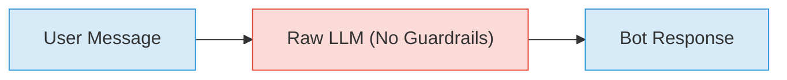
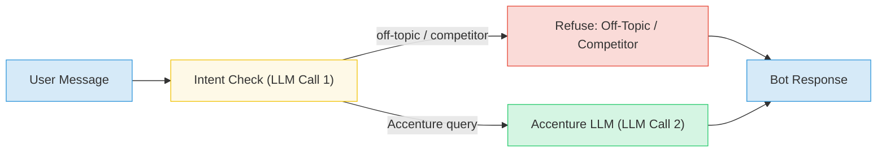
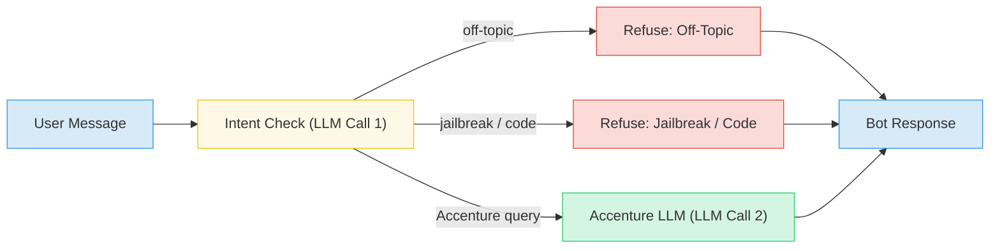
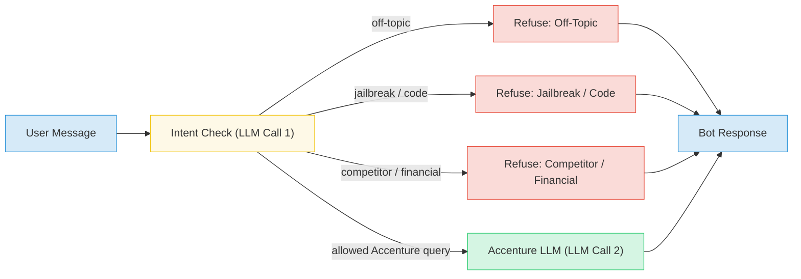
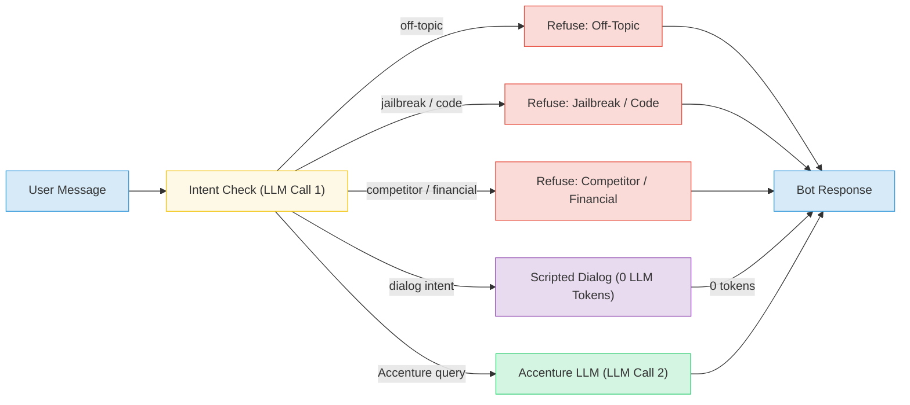
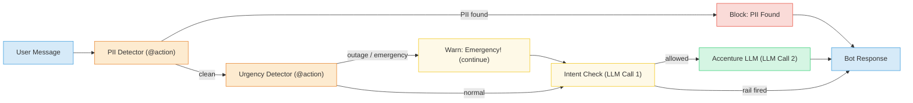
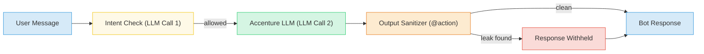
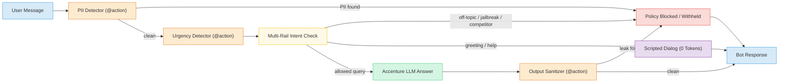

# 🛡️ Accenture Guardrails Enterprise Control Plane

[](https://python.org)
[](https://github.com/NVIDIA/NeMo-Guardrails)
[](https://streamlit.io)
[](https://logfire.pydantic.dev)
[](LICENSE)

An enterprise-grade **AI Safety, Policy Control, Threat Scoring, and Telemetry Control Plane Architecture** built using **NVIDIA NeMo Guardrails (Colang DSL)**, **Groq Cloud LLM Models**, and **Streamlit**.

---

## 📑 Table of Contents
1. [Executive Overview](#-executive-overview)
2. [What Does This Project Do?](#-what-does-this-project-do)
3. [Technology Stack](#-technology-stack)
4. [Architecture & Flow Pipelines (All 8 Experiments)](#-architecture--flow-pipelines-all-8-experiments)
   - [Exp 1: 🔴 Baseline — Raw LLM](#experiment-1--baseline--raw-llm-unguarded)
   - [Exp 2: 🟡 Topic Guard](#experiment-2--topic-guard-input-rails)
   - [Exp 3: 🟡 Jailbreak Shield](#experiment-3--jailbreak-shield-prompt-injection-defense)
   - [Exp 4: 🟡 Sensitive & Policy Block](#experiment-4--sensitive--policy-block)
   - [Exp 5: 🟢 Dialog Rails](#experiment-5--dialog-rails-hardcoded-replies)
   - [Exp 6: 🟢 PII & Urgency Detection](#experiment-6--pii--urgency-detection-custom-python-actions)
   - [Exp 7: 🟢 Output Rail Sanitizer](#experiment-7--output-rail-sanitizer)
   - [Exp 8: 🛡️ Full Production Stack](#experiment-8-️-full-production-stack-complete-shield)
5. [Directory & File Architecture](#-directory--file-architecture)
6. [Local Setup & Quickstart Guide](#-local-setup--quickstart-guide)
7. [Cloud Deployment & CI/CD Pipeline](#-cloud-deployment--cicd-pipeline)

---

## 🎯 Executive Overview

Deploying large language models (LLMs) in enterprise production without guardrails poses critical business and security risks:
- **Brand Damage**: Recommending competitors (e.g. Deloitte, McKinsey, PwC) or leaking sensitive pricing.
- **Security Exploits**: Prompt injection attacks (DAN mode, developer overrides, system prompt extraction).
- **Compliance Violations**: Accidental exposure of Personally Identifiable Information (PII) such as credit cards, SSN, API secrets, or emails.
- **Unauthorized Advice**: Generating legal, financial, or computer code scripts against corporate governance rules.

The **Accenture Guardrails Enterprise Control Plane** provides a live, interactive laboratory demonstrating how **progressive multi-rail stacking** prevents security failures, computes enterprise threat scores (0.0–10.0 scale), and streams real-time telemetry to Pydantic Logfire.

---

## ⚡ What Does This Project Do?

1. **Semantic Input Filtering**: Intercepts off-topic queries and competitor questions using semantic LLM intent classification (Colang DSL) rather than static keyword matching.
2. **Adversarial Jailbreak Shielding**: Blocks prompt injections, DAN mode exploits, and system prompt leaks before they reach the primary inference model.
3. **Sensitive Security Policy Enforcement**: Blocks financial guidance, legal advice, competitor endorsements, and unauthorized code generation.
4. **Scripted Dialog Rails**: Steers standard greetings ("hello", "help", "bye") to hardcoded brand responses, executing at **0 LLM token cost**.
5. **Systematic Custom Python Actions (`@action`)**:
   - `detect_pii_in_input`: Scans every input for emails, phone numbers, SSNs, credit cards, and API tokens.
   - `classify_urgency`: Identifies P0/P1 emergency platform outages and prioritizes client support.
   - `sanitize_output`: Intercepts bot responses before client delivery to ensure zero code blocks, hardcoded credentials, or competitor mentions leak out.
6. **Dynamic Risk Scoring Engine**: Calculates threat vector severity on a 0.0 to 10.0 scale (`LOW RISK`, `ELEVATED`, `CRITICAL`).
7. **Real-Time Observability**: Streams execution traces and audit payloads to **Pydantic Logfire**.

---

## 🛠️ Technology Stack

| Layer | Technology | Description |
| :--- | :--- | :--- |
| **Guardrail Engine** | **NVIDIA NeMo Guardrails (v0.9.0)** | Colang 1.0 DSL for input/output rail orchestration & dialog flow control |
| **Inference Models** | **Groq Cloud API (`openai/gpt-oss-120b`, `gpt-oss-20b`)** | Ultra-low latency LLM inference for guardrail checking and response generation |
| **User Interface** | **Streamlit (v1.35+)** | Interactive control plane workbench, custom input bar, and live execution tracker |
| **Observability** | **Pydantic Logfire (`logfire`)** | Real-time cloud logging, span tracing, and audit telemetry monitoring |
| **Pipeline Graphics** | **Graphviz** | Dynamic DOT execution flow diagrams rendered natively in Streamlit |
| **Runtime & Tooling** | **Python 3.11+ / dotenv** | Environment management, regex scanners, and execution orchestrator |
| **Deployment & CI/CD** | **Render Cloud (`render.yaml`) & GitHub Actions (`ci-cd.yml`)** | Automated linting, policy validation, and cloud hosting |

---

## 📐 Architecture & Flow Pipelines (All 8 Experiments)

### Experiment 1: 🔴 Baseline — Raw LLM (Unguarded)
- **Concept**: The Problem — Unfiltered direct call to the raw LLM.
- **Behavior**: Nothing is blocked. The raw model answers off-topic questions, compares competitors, gives financial advice, or writes Python code.
- **Risk Engine**: Unguarded baseline (0.0 Risk Score).



---

### Experiment 2: 🟡 Topic Guard (Input Rails)
- **Concept**: First NeMo Guardrail using Colang DSL (`define user / define bot / define flow`).
- **Behavior**: Uses LLM intent classification to catch off-topic queries and competitor questions (e.g. Deloitte, McKinsey), restricting replies strictly to Accenture services.



---

### Experiment 3: 🟡 Jailbreak Shield (Prompt Injection Defense)
- **Concept**: Stacks Jailbreak Shield on top of Exp 2.
- **Behavior**: Intercepts DAN mode prompt injections, "ignore previous instructions", system prompt leak attempts, and forced code execution overrides.



---

### Experiment 4: 🟡 Sensitive & Policy Block
- **Concept**: Multi-Rail Stacking (3 Rails Active).
- **Behavior**: Enforces corporate policy: strictly blocks competitor comparisons (Deloitte, McKinsey, PwC), financial investment guidance, legal advice, and computer code generation.



---

### Experiment 5: 🟢 Dialog Rails (Hardcoded Replies)
- **Concept**: Flow Control & Scripted Dialog Management.
- **Behavior**: Matches greetings ("hello"), capabilities ("help"), and farewells ("bye"), returning hardcoded brand answers directly at **0 LLM token cost**.



---

### Experiment 6: 🟢 PII & Urgency Detection (Custom Python Actions)
- **Concept**: `@action` Systematic Input Python Logic.
- **Behavior**: Executes Python code on *every* input message before intent classification:
  - `detect_pii_in_input`: Regex scan for email, phone, SSN, credit cards, API keys. If PII is found, stops immediately.
  - `classify_urgency`: Flags critical platform outages or billing emergencies.



---

### Experiment 7: 🟢 Output Rail Sanitizer
- **Concept**: Response Interception & Leak Prevention.
- **Behavior**: Intercepts the generated LLM response before the user sees it. If the response contains code snippets, hardcoded credentials, or competitor endorsements, the response is withheld.



---

### Experiment 8: 🛡️ Full Production Stack (Complete Shield)
- **Concept**: The Production Enterprise Control Plane.
- **Behavior**: Activates **all 7 NeMo policies and systematic Python actions concurrently** for maximum brand protection, compliance, and zero data leakage.



---

## 📂 Directory & File Architecture

```
ControlPlane/
├── .env                        # API keys & Logfire token
├── .gitignore                  # Git exclusion rules
├── requirements.txt            # Python dependencies (NeMo, Streamlit, Logfire, Graphviz)
├── README.md                   # Complete technical documentation & guide
├── render.yaml                 # Infrastructure Blueprint for Render Cloud deployment
│
├── .github/
│   └── workflows/
│       └── ci-cd.yml           # GitHub Actions pipeline (Flake8 linting & policy validation)
│
└── app/                        # Main Application Package
    ├── __init__.py             # Module package marker
    ├── main.py                 # Streamlit entry point & tab navigation
    ├── models.py               # Model catalog & system prompt definitions
    ├── inference.py            # Guarded & raw LLM inference dispatchers
    ├── actions.py              # Custom Python @action functions & Risk Scoring Engine
    ├── diagrams.py             # Graphviz DOT string pipeline generators
    ├── experiments.py          # Metadata, descriptions & Colang code snippets
    │
    ├── config/                 # Dedicated Guardrails Policy Configuration
    │   ├── policies.co         # Colang 1.0 flow, intent & bot response definitions
    │   └── config.yml          # NeMo model routing & general instructions
    │
    └── ui/                     # UI Layout Modules
        ├── sidebar.py          # API keys & model selection sidebar controls
        ├── experiment_ui.py   # Workbench UI, execution status tracker & chat feed
        └── audit_ui.py        # Real-time audit analytics dashboard & Logfire inspection
```

---

## 💻 Local Setup & Quickstart Guide

### 1. Clone Repository & Navigate
```bash
git clone https://github.com/your-org/ControlPlane.git
cd ControlPlane
```

### 2. Create & Activate Virtual Environment
```bash
# Windows (PowerShell):
python -m venv .venv
.\.venv\Scripts\Activate.ps1

# Linux / macOS:
python3 -m venv .venv
source .venv/bin/activate
```

### 3. Install Dependencies
```bash
pip install -r requirements.txt
```

### 4. Configure Secrets (`.env`)
Create a `.env` file in the root directory:
```ini
GROQ_API_KEY=gsk_your_groq_api_key
GROQ_GUARD_KEY=gsk_your_groq_guardrail_key
LOGFIRE_TOKEN=your_pydantic_logfire_token
```

### 5. Launch Control Plane Dashboard
```bash
streamlit run app/main.py
```
Open `http://localhost:8501` or `http://localhost:8502` in your browser.

---

## ☁️ Cloud Deployment & CI/CD Pipeline

### Deploying to Render Cloud
The project includes a pre-configured [`render.yaml`](file:///c:/Users/Suvxn/OneDrive/Desktop/babita/ControlPlane/render.yaml) Blueprint:
1. Connect your repository to [Render](https://render.com).
2. Select **New Blueprint Instance**.
3. Fill in your environment secrets (`GROQ_API_KEY`, `LOGFIRE_TOKEN`).
4. Click **Deploy**!

### Continuous Integration (GitHub Actions)
The workflow in [`.github/workflows/ci-cd.yml`](file:///c:/Users/Suvxn/OneDrive/Desktop/babita/ControlPlane/.github/workflows/ci-cd.yml) automatically triggers on push/PR to `main`:
- **Step 1**: Sets up Python 3.11 and caches pip dependencies.
- **Step 2**: Runs `flake8` syntax and linting checks.
- **Step 3**: Compiles core Python modules (`py_compile`).
- **Step 4**: Validates Colang policies ([`policies.co`](file:///c:/Users/Suvxn/OneDrive/Desktop/babita/ControlPlane/app/config/policies.co)) and YAML configurations ([`config.yml`](file:///c:/Users/Suvxn/OneDrive/Desktop/babita/ControlPlane/app/config/config.yml)).

---

## 🛡️ License
Distributed under the **MIT License**. Open-source reference architecture for enterprise AI safety and guardrail engineering.
